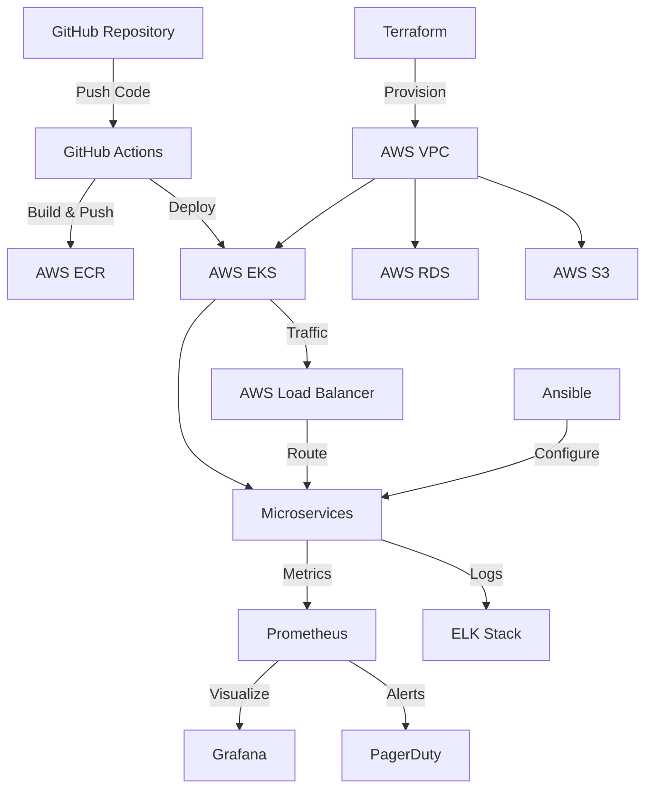

# Trading System Observability Platform

## Architecture Diagram

Below is the architecture diagram for the **sre-project-demo** project, illustrating the key components and their interactions:



**Objective:** This project is a lite application built to demonstrate core Site Reliability Engineering (SRE) principles and technical abilities relevant to the Trading Operations role at GTS.

It simulates a simple trading application and wraps it in a modern observability stack, focusing on the tools mentioned in the job description: **Prometheus, Grafana, Loki, Python, SQL, and Docker.**

---

### Core Features

*   **Mock Trading Application:** A Python service that simulates processing trades, generating logs, metrics, and database records.
*   **Full Observability Stack:**
    *   **Metrics:** Custom application metrics exported to **Prometheus**.
    *   **Logs:** Structured logs aggregated by **Loki** via **Promtail**.
    *   **Dashboards:** A unified **Grafana** dashboard for visualizing metrics and logs side-by-side.
*   **Operational Tooling:** A Python-based CLI tool for operators to query the system without direct database access.
*   **Chaos Engineering Ready:** The system includes a "chaos mode" to simulate outages, proving the effectiveness of the monitoring and alerting setup.

---

### Live Demo (Screenshots)

**1. The Main Grafana Dashboard**
*(Insert a screenshot of your beautiful Grafana dashboard here)*

**2. Investigating an Outage with Chaos Mode**
*(Insert a screenshot or GIF showing the dashboard during chaos mode, with high failure rates)*

**3. The Operator CLI Tool in Action**
*(Insert a screenshot of your terminal showing the output of `python operator_tool.py find_trade --id 10`)*

---

### Tech Stack

*   **Application:** Python, psycopg2-binary
*   **Metrics:** Prometheus
*   **Logging:** Loki, Promtail
*   **Visualization:** Grafana
*   **Database:** PostgreSQL
*   **Orchestration:** Docker, Docker Compose

---

### How to Run

The entire stack is containerized and can be run with a single command.

**Prerequisites:**
*   Docker
*   Docker Compose

**Steps:**

1.  **Clone the repository:**
    ```bash
    git clone [your-repo-url]
    cd trading-sre-project
    ```

2.  **Launch the stack:**
    ```bash
    docker-compose up --build -d
    ```

3.  **Access the services:**
    *   **Grafana Dashboard:** `http://localhost:3000` (Login: admin/admin)
    *   **Prometheus UI:** `http://localhost:9090`
    *   **Loki (API):** `http://localhost:3100`

4.  **Use the Operator Tool:**
    ```bash
    # Make sure your Python venv is active or install dependencies
    # pip install psycopg2-binary tabulate

    # Find a trade by ID
    python operator_tool.py find_trade --id 25

    # Investigate recent "failures"
    python operator_tool.py investigate_failures --limit 3
    ```

5.  **Trigger Chaos Mode (Optional):**
    ```bash
    # To enable chaos mode:
    docker-compose exec simulator touch chaos.flag

    # To disable chaos mode:
    docker-compose exec simulator rm chaos.flag
    ```
---
